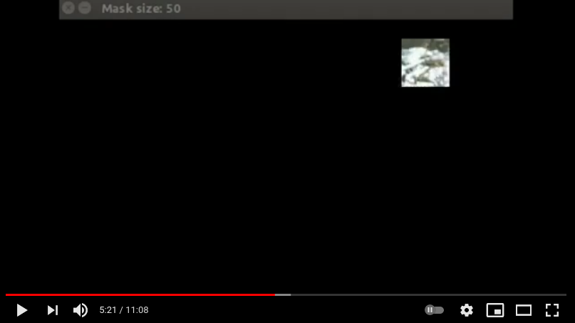

  
Human Neural Tests:  
  
These are programs designed to test if the human brain really processes information in the same way we attempt to mimic in Artificial Neural Networks and in Artificial Intelligence algorithms in general.  
  
HumanNeuralNetTest1: FeatureRecognitionUnderMask  
A human user is presented with a hidden image that is exposed by a small moving square shaped mask which reveals the image behind the mask. With every iteration, the mask size increases and the human is requested to try and find recognizable features in the image at every iteration of a mask size.
The video: https://youtu.be/ITZKgpA1MYI

